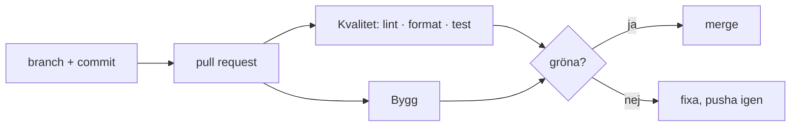

# Pipeline

| Steg | Tid (provkörning 25/9) |
|---|---|
| `npm ci` | 3–8 s |
| lint | ~1 s |
| format:check | <1 s |
| test | ~2 s |
| build | ~2 s |
| Hela körningen | ~21 s |

Rulesetet `main`: PR krävs (1 godkännande), checkarna `Kvalitet` och `Bygg` måste vara gröna och branchen uppdaterad, force push blockerat. Ingen bypass.
